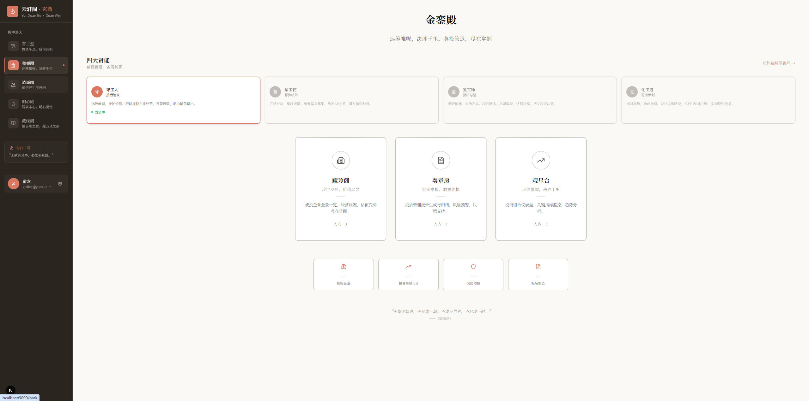

# 云轩阁

> 云轩阁中，百工汇聚，逍遥自在，问道求真。

一个古风意境的 AI 助手应用，融合中国传统文化与现代人工智能技术，为您提供沉浸式的数字体验。

## 功能模块

### 百工堂

群贤毕至，各司其职，为君分忧解劳。

| 智能体 | 职责 | 描述 |
|--------|------|------|
| 周报先生 | 文书撰写 | 为君执笔，妙手成章。周报、日报、总结，信手拈来。 |
| 审码御史 | 代码审查 | 明察秋毫，去芜存菁。为你的代码把关护航。 |
| 灵犀阁主 | 头脑风暴 | 集思广益，触类旁通。与你共探无限可能。 |
| 算筹博士 | 数据分析 | 洞察数理，明辨趋势。让数据为你说话。 |
| 通译使者 | 翻译润色 | 贯通中西，信达雅兼。助你跨越语言之障。 |
| 记事书童 | 会议纪要 | 耳聪目明，笔录如飞。不遗漏每一个要点。 |

### 逍遥园

偷得浮生半日闲，且听风吟且品茗。

- **吐纳术** - 调息养气，静心凝神
- **晨言录** - 一言一悟，启迪心智
- **天籁阁** - 万籁俱寂，唯余天音
- **丹青坊** - 挥毫泼墨，随心所欲

### 问道阁

吾日三省吾身，修心养性，破迷开悟。

- **观心室** - 闭目内观，洞察本心
- **论道场** - 以辩明理，以论破执
- **藏经阁** - 典籍浩瀚，智慧如海
- **明心殿** - 鉴往知来，明心见性

### 贤本轩（投资平台）

运筹帷幄之中，决胜千里之外。募投管退，闭环管理。

- **藏珍阁** - 被投企业全景一览，经营状况、估值变动尽在掌握
- **奏章房** - 投后管理报告生成与归档，风险预警，决策支持
- **观星台** - 投资组合仪表盘，关键指标监控，趋势分析

投资智能体：募师（募资）、探花（投资）、护院（投后）、归客（退出）

## 技术栈

- **框架**: Next.js 16.2.1 + React 19.2.4
- **语言**: TypeScript 5
- **样式**: Tailwind CSS 4 + shadcn/ui
- **状态管理**: Zustand 5
- **图标**: Lucide React
- **AI 服务**: 支持 OpenAI / Azure OpenAI / 自定义端点

## 快速开始

### 环境要求

- Node.js 18.0 或更高版本
- npm 或 pnpm

### 环境变量

创建 `.env.local` 文件：

```env
# AI 服务配置（可选，默认使用 Mock 服务）
OPENAI_API_KEY=your_api_key
OPENAI_BASE_URL=https://api.openai.com/v1
```

### 安装依赖

```bash
npm install
```

### 开发模式

```bash
npm run dev
```

访问 [http://localhost:3000](http://localhost:3000) 查看应用。

### 构建生产版本

```bash
npm run build
npm start
```

## 项目结构

```
src/
├── app/                    # Next.js 应用路由
│   ├── cultivation/        # 问道阁模块（修心养性）
│   │   ├── archive/        # 明心殿
│   │   ├── arena/          # 论道场
│   │   ├── library/        # 藏经阁
│   │   └── quiet-room/     # 观心室
│   ├── investment/         # 贤本轩模块（投资平台）
│   │   ├── dashboard/      # 观星台
│   │   ├── portfolio/      # 藏珍阁
│   │   └── reports/        # 奏章房
│   ├── park/               # 逍遥园模块（休闲娱乐）
│   │   ├── breathing/      # 吐纳术
│   │   ├── canvas/         # 丹青坊
│   │   ├── quotes/         # 晨言录
│   │   └── sounds/         # 天籁阁
│   └── workspace/          # 百工堂模块（AI 助手）
│       └── chat/           # 智能体对话
├── components/             # React 组件
│   ├── chat/               # 聊天相关组件
│   ├── effects/            # 特效组件
│   │   ├── fuchen-cursor.tsx      # 拂尘光标
│   │   └── immortal-transition.tsx # 仙气页面切换
│   ├── layout/             # 布局组件
│   └── ui/                 # UI 基础组件
└── lib/                    # 工具库
    ├── agents.ts           # 智能体配置
    ├── ai-config.ts        # AI 配置
    ├── ai-service.ts       # AI 服务
    ├── mock-ai.ts          # AI Mock 服务
    ├── store.ts            # 状态管理
    └── types.ts            # 类型定义
```

## 设计理念

云轩阁以中国传统文化为底蕴，采用古典雅致的视觉风格：

- **色彩**: 以朱砂色 (#d97760) 为主色调，配以墨色、古纸色等传统配色
- **字体**: 衬线字体营造古典韵味
- **交互**: 细腻的动画过渡，营造沉浸式体验

### 古风交互动效

- **拂尘光标** - 道教浮沉风格的自定义鼠标光标，点击时展现流畅的甩动动画，鬃毛飘逸，仙气十足
- **仙气页面切换** - 页面切换时云雾缭绕，仙气粒子飘散，营造沉浸式体验

截图



## 许可证

本项目仅供学习交流使用。
